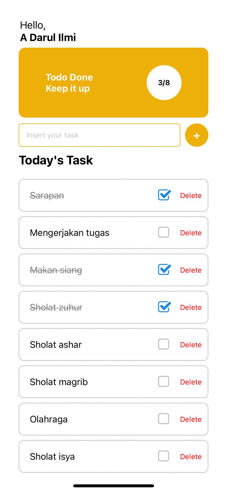

# Simple Todo List

A simple todo list application built using React Native. This app allows you to add tasks, mark them as completed, and delete them as needed. It includes basic features such as task tracking and task status (completed/incomplete).

## Feature

- `Add Tasks`: Type a new task in the input field and press the "+" button to add it to the list.
- `Mark Tasks as Completed`: Tap the checkbox next to a task to mark it as completed.
- `Delete Tasks`: Tap the "Delete" button next to a task to remove it

